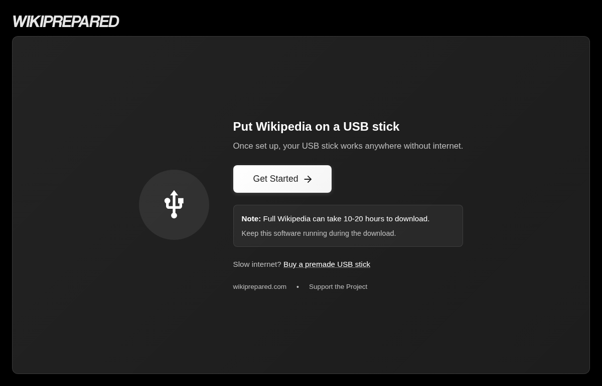

# WikiPrepared

**Build and update an offline Wikipedia USB drive.**

[](https://github.com/coding-crying/WikiPrepared/releases/latest)
[](https://github.com/coding-crying/WikiPrepared/actions/workflows/release-builds.yml)
[](LICENSE)
[](https://www.wikiprepared.com)

[Download](https://www.wikiprepared.com/us/download) · [Documentation](docs/README.md) · [Report a bug](https://github.com/coding-crying/WikiPrepared/issues/new/choose)

Knowledge access is fragile when it depends on stable internet, centralized platforms, and changing policies. WikiPrepared helps people, schools, and communities keep their own copy of Wikipedia—not just a bookmark to it.

Choose your content, download it, and prepare a USB drive with Kiwix readers for offline access.



*The welcome screen, captured from the running desktop app built from current source.*

## Download and get started

**Linux downloads are available now:** [AppImage and Debian package](https://github.com/coding-crying/WikiPrepared/releases/latest). Windows and macOS release downloads are coming soon.

1. Download the Linux package that suits your system. For AppImage, enable **Allow executing file as program** in its file properties, then launch it. For `.deb`, use your package manager.
2. Click **Get Started** and follow the prompts to select your USB drive and content.
3. Select your Wikipedia content and the readers you need.
4. Let the download and transfer finish, then safely eject the drive.
5. Open the appropriate `START` launcher on the USB. Try it with the internet disconnected before putting the stick away.

Internet access is needed to fetch the catalog, content, and readers. The prepared content is intended to be read offline.

> **Before you start:** Back up the drive. Formatting erases its contents. Check the selected device carefully, and leave enough space for both the content and readers.

## What it does

- Shows removable drives, capacity, free space, and filesystem details.
- Filters Wikipedia ZIM content by language, topic, and edition (`mini`, `nopic`, `maxi`).
- Downloads with queueing, progress, pause, resume, and cancellation.
- Supports downloading directly to USB or saving locally before transferring.
- Finds installed ZIM files and checks for newer catalog versions.
- Downloads Kiwix readers and creates portable desktop launchers.
- Checks SHA-256 against a server checksum when one is available. Otherwise it stores a local checksum and labels the download **unverified**—a locally calculated hash alone does not establish authenticity.

## Compatibility and current limits

- **USB filesystem:** exFAT is recommended for large files shared across desktop platforms. FAT32 cannot hold individual files of 4 GiB or larger. Test the finished stick on the computers you intend to use.
- **Readers:** Availability and launch behavior vary by operating system. Preparing readers for another platform is not a substitute for testing on that platform.
- **Maps:** `maps-scaffold/` is experimental, not part of the packaged app. It still has online dependencies and unfinished controls.
- **Signing:** The release workflow does not currently provide signed Windows or notarized macOS installers. Do not treat an unfamiliar download as trusted just because it uses this project's name.

Reliability and clear failure recovery matter more here than a long feature list. Cross-platform testing and recovery from interrupted downloads are ongoing priorities.

## Development

Electron, React + MUI, and Node.js. The main process handles drives, files, downloads, and Kiwix integration; the renderer provides the step-by-step UI.

Use **Node.js 20** to match the release workflow, plus npm and Git. Native drive dependencies may require your platform's build tools.

```bash
git clone https://github.com/coding-crying/WikiPrepared.git
cd WikiPrepared
npm ci
npm run dev
```

Useful commands:

```bash
npm run webpack:prod  # Compile production bundles
npm run dist          # Package with electron-builder for this platform
npm run dist:win      # Windows distributables; run on Windows
npm run dist:mac      # macOS distributables; run on macOS
```

**Quality-check status:** `npm test` currently finds no tests, and `npm run lint` needs an ESLint configuration. The badge above reports release builds, not test coverage. See [Contributing](CONTRIBUTING.md) for verification expectations.

## Documentation

- [Documentation index](docs/README.md)
- [Development setup](docs/DEVELOPMENT.md)
- [Architecture](docs/ARCHITECTURE.md)
- [Feature inventory and roadmap notes](docs/FEATURES.md)
- [USB instructions shipped with the app](src/main/assets/README.txt)

Source lives in `src/main/`, `src/renderer/`, and `src/shared/`. Implementation notes and historical testing reports live in `docs/`.

## Contributing and support

Found a broken download, confusing screen, or a drive that behaves differently? [Open an issue](https://github.com/coding-crying/WikiPrepared/issues/new/choose). Include your operating system, app version, and what happened. Please remove personal paths and other sensitive details from logs.

[Contributions](CONTRIBUTING.md) are welcome, especially around cross-platform USB reliability, failure recovery, and download/transfer tests.

## Credits and license

WikiPrepared builds on [Kiwix](https://kiwix.org), [Wikipedia](https://www.wikipedia.org), and the people who make their content available offline. It is an independent project, not an official Wikimedia or Kiwix application. Content and bundled readers retain their own licenses.

Copyright (C) 2025 WikiPrepared Contributors.

WikiPrepared is free software under the **GNU General Public License, version 3 or later**. See [LICENSE](LICENSE) for the full terms.
